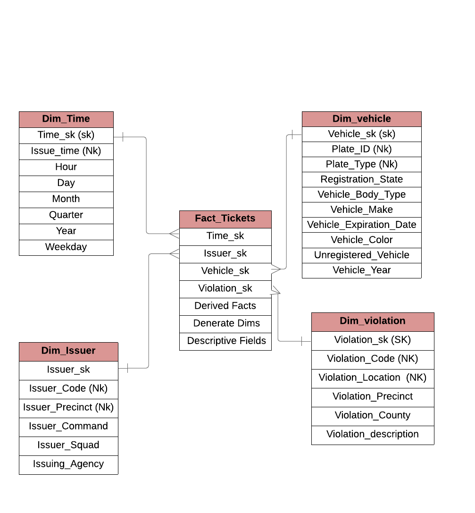

## NYC parking dataset 

__Data Set__ 
- _Primary Data
  - This is a collection of Parking Violations Issued Fiscal Year 2016. 
  - This contains 43 fields, with 10.8 Million rows
`source: Kaggle [Download link](https://data.cityofnewyork.us/City-Government/Parking-Violations-Issued-Fiscal-Year-2017/2bnn-yakx)`  
 
- _lookup Data
  - Took the volation cd and the price charged for the respective violations
`source: City of Newyork Website` 
 
__Fields__ 
  - Below are the fields present in the file 

```
Summons Number 
Plate ID 
Registration State 
Plate Type 
Issue Date 
Violation Code 
Vehicle Body Type 
Vehicle Make 
Issuing Agency 
Street Code1 
Street Code2 
Street Code3 
Vehicle Expiration Date 
Violation Location 
Violation Precinct 
Issuer Precinct 
Issuer Code 
Issuer Command 
Issuer Squad 
Violation Time 
Time First Observed 
Violation County 
Violation In Front Of Or Opposite 
House Number 
Street Name 
Intersecting Street 
Date First Observed 
Law Section 
Sub Division 
Violation Legal Code 
Days Parking In Effect  
From Hours In Effect 
To Hours In Effect 
Vehicle Color 
Unregistered Vehicle? 
Vehicle Year 
Meter Number 
Feet From Curb 
Violation Post Code 
Violation Description 
No Standing or Stopping Violation 
Hydrant Violation 
Double Parking Violation 
```
[initial load spark script](inital_load.py) 
[Incremental load spark script](incremental_load.py)

__Data Model__

